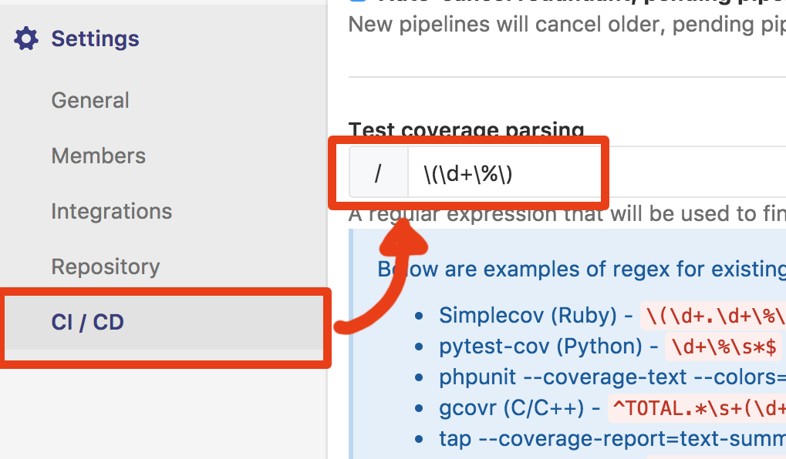

# Delorean java

une implémentation de delorean en java

- PRENOM NOM ELEVE 1, prenom.nom@monmail.com
- PRENOM NOM ELEVE 2, prenom2.nom2@monmail.com

1. Mettre vos noms ci dessus
2. Mettre à jour les liens status avec le numéro de projet
3. Dans les settings du projets, onglet CI/CD entrez la configuration de couverture suivante ``\(\d+\%\)``
 
4. Réaliser les fonctionnalités du [TODOs](#todos)

## liens status ( à mettre à jour )

(remplacer 00 par le numéro du projet pour activer les badges):

[](https://gitlab.iut-blagnac.fr/git_2018/delo-java-00/commits/develop)
[](https://gitlab.iut-blagnac.fr/git_2018/delo-java-00/commits/develop)


## Lancer les tests

```bash
mvn test
```

## Produire un rapport html de la couverture de test

```bash
mvn cobertura:cobertura
# produit un rapport dans
# target/site/cobertura/index.html
```

## <a name="todos"></a> TODOs V1.1.0

### BUG selecteur

- Corriger le bug du selecteur temporel pour que les tests passent

### Ajout lentille gravitationnelle

- ajouter la méthode ``void enableAntigravityLens()`` dans la classe ``Delorean``
- ajouter la méthode ``void disableAntigravityLens()`` dans la classe ``Delorean``
- ajouter la méthode ``isFlying()`` dans la classe ``Delorean`` qui
  renvoie ``true`` quand la lentille est activée.
- ajouter le test ``testDeloreanAntigravity()`` dans ``deloreanTest.java``

### Amélioration du réacteur en reacteur à déchets

- remplacer la méthode ``insertPlutonium()`` par la méthode ``insertWaste()`` dans la classe ``Delorean``
- remplacer la méthode ``hasPlutonium()`` par la méthode ``hasWaste()`` dans la classe ``Delorean``
- remplacer la méthode ``testDeloreanInsertPlutonium()`` par la méthode ``testDeloreanInsert_waste()`` dans ``deloreanTest.java``

### Ajout climatisation

- ajouter la méthode ``setTemperature(int temperature)`` dans la classe ``Delorean``
- ajouter la méthode ``getTemperature()`` dans la classe ``Delorean``
- ajouter le test ``testDeloreanTemperature()`` dans ``deloreanTest.java``

